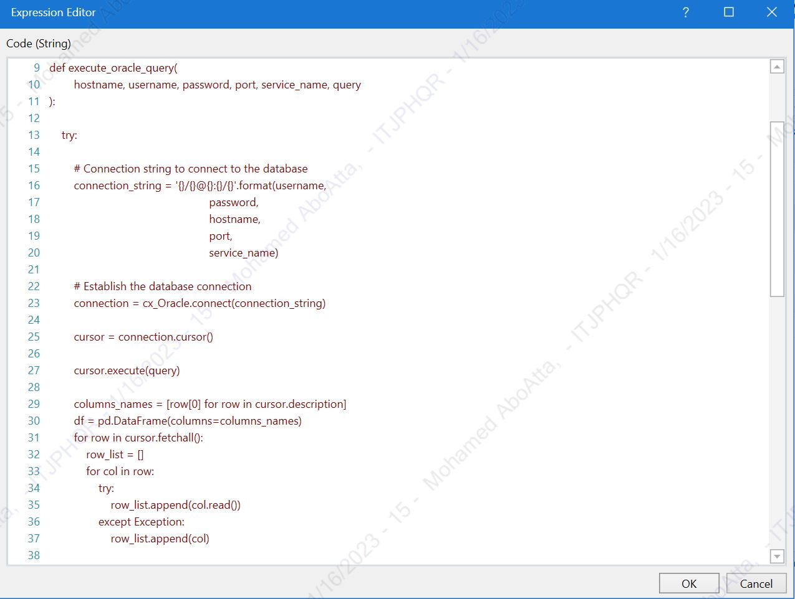
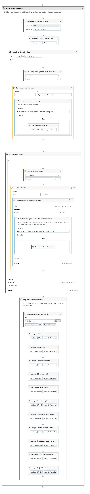

[![LinkedIn][linkedin-shield]][linkedin-url]

<!-- PROJECT LOGO -->
 

    
  <h3 align="center">Pending Requests Resolution Robot</h3>

<!-- TABLE OF CONTENTS -->

  
Table of Contents

  <ol>
    <li>
      <a href="#about-the-project">About The Project</a>
      <ul>
        <li><a href="#business-case">Business Case</a></li>
        <li><a href="#technical-solution">Technical Solution</a></li>
        <li><a href="#flowchart">Flowchart</a></li> <!-- Only if present -->
        <li><a href="#screenshots">Screenshots</a></li> <!-- Only if present -->
        <li><a href="#tech-stack">Tech Stack</a></li>
      </ul>
    </li>
    <li><a href="#contact">Contact</a></li>
  </ol>

<!-- ABOUT THE PROJECT -->
## About The Project

* **Project Name:** Pending Requests Resolution Robot  
* **Version:** v1.0.38  
* **Department:** Technology

---

### Business Case

In our organization, the billing system often generates pending requests that remain unresolved in the provisioning system. These pending requests delay customer request fulfillment, affecting overall customer satisfaction. The **Pending Requests Resolution Robot** was developed to automate the handling of these unresolved service requests (SRs) and reduce the workload on the IT Front Line team.

The robot is designed to process 35% of the total SRs assigned to the IT Front Line team, improving efficiency and ensuring timely resolution of customer requests.

(<a href="#readme-top">back to top</a>)

### Technical Solution

The robot automates the resolution of pending requests by:
* Extracting SRs assigned to the IT Front Line team from the Remedy application.
* Filtering SRs related to specific pending requests such as:
  * Pending / Service Account
  * Error MSG / Change Rate Plan
  * Error MSG / Change Status
  * Error MSG / SIM Card
  * Supplementary_not_compatible
  * Error MSG / Add Service
  * Pending / Activation Portal GSM
* Performing the necessary API calls, database queries, and procedures on Oracle databases to resolve the pending requests.

This solution integrates with both frontend and backend systems, leveraging UiPath for Remedy automation and Python for API calls and database interactions.

(<a href="#readme-top">back to top</a>)

### Flowchart

(<a href="#readme-top">back to top</a>)

### Screenshots

(<a href="#readme-top">back to top</a>)

### Tech Stack

This project was developed using the following tech stack:

* **UiPath**
* **Python**

(<a href="#readme-top">back to top</a>)

<!-- CONTACT -->
## Contact

Mohamed AbdelGawad Ibrahim - [@m-abdelgawad](https://www.linkedin.com/in/m-abdelgawad/) - <a href="tel:+201069052620">+201069052620</a>

(<a href="#readme-top">back to top</a>)

<!-- MARKDOWN LINKS & IMAGES -->
[linkedin-shield]: https://img.shields.io/badge/-LinkedIn-black.svg?style=for-the-badge&logo=linkedin&colorB=555
[linkedin-url]: https://www.linkedin.com/in/m-abdelgawad/
